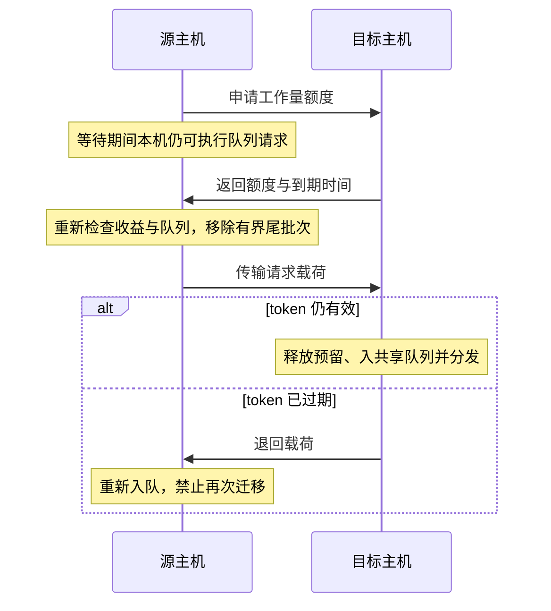

# QBR 算法、模型与实现对应

## 1. 状态和可见性

请求实际服务需求 `service_us` 只由执行引擎读取。策略使用类别均值加固定主机开销：

\[
\hat s_i=\mu_{c_i}+2.1\ \mu s.
\]

每台主机维护共享 FIFO、可迁移请求链表和增量队列工作量。运行中请求的估计剩余量随本机执行速度递减，下限为类别先验的 25%；它是可替换的启发式，**不是实际剩余时间**。局部降速被建模为本机可知的配额/限速变化；未知外部干扰下还需要服务能力估计器。

远端状态只有网络传回的时间戳摘要。每源端最多读取 4 个固定候选目标；摘要沿对应的订阅关系发送。迁移候选扫描最多为批量上限的两倍。当前内存中按主机编号存储摘要，不能把该实现称为已经实现 O(k) 每主机存储。

JSW 入口维护每目的地累计发送工作量，与快照携带的累计已接收工作量相减，估计入口在途和快照后新增负载。它扫描全部主机，是小规模机架的强参考；并未证明交换机流水线可实现相同全局最小搜索。

## 2. 批量工作量预算

令源端估计工作量为 \(W_s\)，处理速率为 \(r_s\)；目标对应为 \(W_d,r_d\)。转移 \(x\) 工作量后，用流体近似比较：

\[
T_s'=(W_s-x)/r_s,\qquad T_d'=D+(W_d+x)/r_d.
\]

要求 \(T_s'-T_d'\ge m\)，得到候选上限：

\[
x^*=\left[\frac{W_s/r_s-W_d/r_d-D-m}{1/r_s+1/r_d}\right]_0^{X_{max}}.
\]

这里 \(D\) 初始包括三次单程网络延迟、决策 CPU 和摘要年龄惩罚；实际事件仍逐次经历 CPU/链路排队。\(m\) 为固定收益余量。该式是**均衡工作量的启发式**，不能证明每个被迁移请求会更快，也不是 P99 上界；真实混合服务与同机并行执行会违反流体近似。

触发要求连续两次检查源端估计排空时间超过 20 μs，且队首请求的等待与预估完成接近类别 SLO。队首风险用于判断整条队列压力，不等于对队尾每个请求做了严格的 SLO 证明。

默认最多 32 个请求、16 KiB（含批次头）、800 μs 估计工作量，不等待凑齐 32 个。

## 3. 目标额度与状态机

目标的控制线程串行计算：

\[
G=\min\{x^*,\max(0, A r_d-W_d-R_d)\},\quad A=40\ \mu s.
\]

\(R_d\) 只包含该目标已经发出但未消费/释放的额度。目标预留 \(G\)，返回有效期 60 μs 的 token。新入口请求和之后发生的容量变化仍可能让实际队列超过这个阈值；它不是永久队长硬上界。

数据转发开始时才把请求从 `Queued` 改为 `Transit`；运行中任务不参与迁移。目标消费或过期都通过一次性的 token 关闭操作释放预留。源端不能查询目标 token 的即时关闭状态，只能使用收到的额度与到期时间；有效性由目标收到载荷时检查。

此协议的正确性范围是可靠、无重复的模拟通道。未实现真实丢包、主机崩溃、重试去重和跨机器恰好一次语义。

## 4. 时间与资源模型

- 同时刻优先级：完成、网络到达/容量变化、生成请求、控制事件；同级按确定序号。
- 每个 worker 串行执行，容量变化更新真实剩余工作并使旧完成事件失效。容量因子作用于服务需求和 2.1 μs 主机开销之和。
- 每主机单个专用控制 CPU；入口单个专用 CPU。消息接收、报告、决策及抽取预算占用这些资源。执行器和控制器使用不同核心，所有方法拥有同等硬件预算。
- 每主机发送、接收链路分别串行；接收链路在数据真正到达时仲裁。请求/响应、控制消息及迁移载荷均计入字节和传输时间。入口/客户端端口被假定为聚合多端口，没有单个共享上行链路瓶颈。
- 初次分发到主机的数据在发送链路和接收链路分别计一次序列化；响应到聚合客户端计发送序列化。因此单请求解析校验用 `2×network + 3×payload_serialization + ingress_cpu + service + host`。
- `.25 μs` 决策、`.015 μs` 每批次候选槽 CPU 等均为假设，未用当前机器计时冒充 SmartNIC 或跨主机实测。
- 完成所有请求后停止；不会因达到完成数门限丢掉窗口内的慢请求。

CPU/消息计数按**事件时间窗口**统计；SLO、延迟和迁移比例按**请求到达窗口**统计。跨预热/排空边界时两个群体不同，不能拿两个原始计数直接相除。报告中的 `migrated_fraction` 已按请求群体重算。

## 5. 对照实现中的重要差异

- `jbsq`：中央等待队列，每主机最多 `depth×workers` 个未完成请求；响应反馈抵达入口并消耗接收 CPU 后归还额度。它是主机共享队列版本，不能冒称逐 worker 的原始 R2P2 全系统。
- `steal`：目标空闲时先在本地预留接收额度，再向源端拉取。它需要请求和数据两个方向，未被人为加上 QBR 的第三段握手。
- `threshold`：共用 QBR 通道与接收预留，仅采用源压力和固定批次上限。
- `single`：QBR 批次上限为 1。
- `work`：在 JBSQ 计数上限内，当未完成数至少为 worker 数时，再要求新增请求不超过估计工作量上限；选择估计未完成工作最少的目的地。
- `bwc`：`work` 的完成工作量/数量在主机最多等待 2 μs 后聚合传回。仍逐请求执行和响应，不等待收齐应用任务。

`work` 的额度直到完成才归还，且计入运行中请求的完整先验工作，可能低估可用并行度；其负面结果不能泛化为所有按工作量准入机制均无效。

## 6. 文件

- `include/qbr/model.h`：参数、输入和摘要边界。
- `src/qbr/simulator.cpp`：事件引擎、策略、额度和统计。
- `tests/qbr_tests.cpp`：解析时延、降速残量、确定性、请求守恒、额度/字节/批次界和超时回退。
- `scripts/qbr_trace.py`：独立生成外生输入。
- `scripts/qbr_study.py`：冻结配置、配对运行、SHA-256、逐请求迁移比较。
- `scripts/qbr_analyze.py`：配对区间、结果表及 PDF/PNG 图表。
