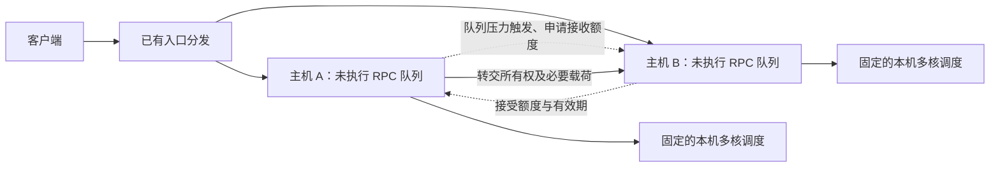

# 主机间微秒级 RPC 重调度：文献复核与选题建议

检索截止：2026-09-25。本文结合当前项目、会议/作者原文及公开论文库，重点核对了 2024–2026 年工作，并补充必要的早期基础论文。这是针对选题的定向调研，不是穷尽所有相关工作的系统综述。论文效果均为作者在各自配置下的报告；没有复现这些外部系统。

**建议：支持回到主机间，但暂不把“网卡队列 + 主动迁移”确立为已经成立的创新点。优先验证“反馈滞后和短时容量变化下，对已经分发、尚未执行的 RPC 做有成本约束的跨主机重调度”。**

这个建议保留主动迁移思想，同时要求先回答两个问题：强入口分发之后是否仍有足够大的改善空间，以及真实转发成本是否小于能节省的等待时间。现有实验可以作为探索材料，尚不足以回答这两个问题。

本文把你说的“容错太小”理解为调度开销、预测误差与剩余时延预算之间的余量太小；主机故障恢复是另一个问题。

## 1. 对你们想法的客观评价

### 主机级抽象成立，但成立的方式需要调整

RackSched 已采用 ToR 交换机做主机间分发、服务器做主机内调度的两层结构。这支持将论文贡献集中在主机间，让主机内部使用固定策略。[RackSched，OSDI 2020](https://www.usenix.org/conference/osdi20/presentation/zhu)

不过，**固定主机内策略与忽略主机内状态不是一回事**。即使同样有 16 个核心、同样排着 16 个请求，所有核心都在运行长请求和多数核心马上空闲时，后续请求的等待时间也可能相差很大。把一台主机替换成速度为 16 倍的单服务器，会改变并行执行和队尾等待的含义。

建议把一台主机建模为“一个逻辑入口队列 + 多个执行核心”，明确核心何时取走请求。主机向外提供少量摘要，例如最老等待时间、分类型积压、近期完成速率、可接收额度及其时间戳。内部调度策略可以固定，但有效处理能力应当保留为可测量、可能变化的量。

### 队列在网卡旁边，并不能隔绝主机的执行变化

| 你可能指的“网卡队列” | 实际含义 | 需要补充的条件 |
| --- | --- | --- |
| 普通 NIC 的 RX ring / RSS 队列 | 通常是报文/描述符队列，相关缓冲区多在主机内存 | 必须有 RPC 边界识别、所有权和撤回机制；不能默认任意删除一个请求 |
| 主机内存中的逻辑 RPC 入口队列 | 网络代理收齐请求后排队，工作线程领取 | 最适合先做软件原型；代理占核、同步和转发都应计成本 |
| SmartNIC 上的请求队列或元数据队列 | NIC 有可编程计算与存储，参与任务分发 | 要实现 CPU 可用性反馈、NIC–CPU 协议、缓存/载荷管理 |
| ToR 交换机上的集中队列 | 等待位置在网络中，可能覆盖多个主机 | 面临流水线、寄存器容量、载荷存放和取任务延迟约束 |

RingLeader 专门设计 NIC 与 CPU 的协作、有限缓冲与反馈。HotOS 2025 的 *The NIC should be part of the OS* 进一步讨论让 NIC 获取 OS 状态的架构。这些工作支持 NIC 参与调度，也说明 NIC 需要知道主机状态。[RingLeader](https://www.usenix.org/system/files/nsdi23-lin.pdf)，[HotOS 2025 原文](https://people.inf.ethz.ch/~troscoe/pubs/hotos25-lauberhorn.pdf)

Rakaia 则从 TCP 消息语义和内核接收路径解决主机内队头阻塞。即便不采用它，也应检查自己的 RPC 是否已经完整到达、是否仍可撤回，而不能把 TCP 字节流直接当成可迁移任务队列。[Rakaia，OSDI 2026](https://www.usenix.org/conference/osdi26/presentation/yang-rui)

### 跨主机不会自然获得更大的调度余量

同样一个请求，从等待队列搬到另一个核心，通常比转发到另一台主机需要更少的数据路径步骤。跨主机有价值的原因应当是：**另一台主机仍有本机无法提供的可用容量**，其带来的排队时间节省超过网络和协调成本。

例如，以下只是说明判据的假设数字：源端还要等 80 μs，转发与协调共 10 μs，目标端还要等 5 μs，执行成本相同时，迁移可能节省 65 μs；源端只等 4 μs 时，相同迁移就不合算。因此，“单机难做，所以跨机更容易”并不成立；跨机需要更强的局部失衡动机。

## 2. 直接影响新颖性的论文

下表的“影响”是本次调研后的判断，不是原论文替你证明的结论。原文和本地 PDF 的完整对应见[阅读索引](参考文献/阅读索引.md)。

| 论文 | 已经处理的问题 | 对你选题的影响 |
| --- | --- | --- |
| R2P2，ATC 2019 | RPC 语义与 JBSQ：网络侧等待，限制服务器未完成请求数 | 必须比较“晚一点决定执行位置”是否已消除迁移需求 |
| RackSched，OSDI 2020 | 网络分发与主机内调度协作 | 为两层抽象提供依据，但不是对 NIC 单独屏蔽主机状态的证明 |
| Draconis，EuroSys 2024 | 交换机中心队列，由空闲执行器拉取 | 必须计入拉取空档，同时检验中心排队是否更直接 |
| Pallas，ATC 2025 | 按 CPU 需求整形；重配置回弹；突发复制 | 与“分发后纠正”最直接的一组竞争机制 |
| Rain，PACMNET/CoNEXT2 2026 | 中心元数据队列、worker token、RDMA 载荷预写、动态本地队列深度 | “网络队列 + 信用 + 自适应深度”也已有近期工作 |
| Capybara，SIGCOMM 2026 | 对已建立 TCP 连接做主机间动态迁移，包含主动和反应式策略 | 泛称“跨主机主动迁移”已不够；必须区分请求与连接的粒度和语义 |
| Altocumulus，MICRO 2022 | 单机内预测、批量主动迁移、硬件快速协调 | 批量、队列分布和一次迁移限制本身不能作为独立新颖性 |
| Hawk，ATC 2015；Sparrow，SOSP 2013 | 分发后窃取；延迟绑定与多调度器竞争 | 概念基础，时间尺度不同，不能照搬其成本或性能数字 |

原始来源：[R2P2](https://www.usenix.org/conference/atc19/presentation/kogias-r2p2)、[Draconis](https://cs.uwaterloo.ca/~alkiswan/papers/Draconis-EuroSys24.pdf)、[Pallas](https://www.usenix.org/conference/atc25/presentation/liao)、[Rain](https://arxiv.org/abs/2606.03352)、[Capybara](https://irenezhang.net/papers/capybara-sigcomm26.pdf)、[Altocumulus](https://www.eecg.utoronto.ca/~mcj/papers/2022.altocumulus.micro.pdf)、[Hawk](https://www.usenix.org/system/files/conference/atc15/atc15-paper-delgado_update.pdf)、[Sparrow](https://people.csail.mit.edu/matei/papers/2013/sosp_sparrow.pdf)。

### 三处必须准确理解的区别

**Pallas 的回弹与复制不是同一个机制。** §4.4 的回弹发生在服务分组变化时：清走原来排队的长请求，让新分配的短请求得到服务。§4.5 的短时突发机制是复制到较空闲的组，目标无空闲核心就丢弃副本。因此，不能用一个随意设阈值的回弹算法代称“完整 Pallas”，也不能说它尚未考虑分发后的纠正。[Pallas 正文 §4.4–4.5](https://www.usenix.org/system/files/atc25-liao.pdf)

**Capybara 的微秒迁移不等于每微秒运行一次全局调度。** 它包含周期性负载通知和服务器本地反应式策略，迁移的是连接状态及必要的应用连接状态。论文报告小状态配置下主机 CPU 开销低于 3 μs、包含网络往返的总迁移时间低于 15 μs；这不能拿来直接设定本项目的 RPC 转发常数。[Capybara §5、§8.2.3](https://irenezhang.net/papers/capybara-sigcomm26.pdf)

**Rain 不能简单标成未经发表的预印本，也不能据它断言完整 Pallas 已被淘汰。** 原始页面给出正式发表信息：Proc. ACM Netw. 4, CoNEXT2, Article 22，2026 年 6 月。其 §5.2 将各方案统一到同一种 worker 模型，使用 `-SW` 标记交换机侧实现；比较并不等于原系统完整栈之间的排名。[Rain 元数据与全文](https://arxiv.org/abs/2606.03352)

## 3. 我建议优先确立的研究问题

建议的工作标题：**面向反馈滞后与短时容量变化的微秒级 RPC 跨主机有界重调度。**

具体问题是：入口已使用合理负载均衡，但在反馈更新之前，一部分主机积压加重；能否利用主机侧更新鲜的局部观测、目标端确认的接收额度，以及有界的请求批次，在通信与控制预算内改善按时完成率？

推荐边界如下：

- 同一机架中的已启动服务副本；首个原型采用无状态计算或数据已在目标副本上的读请求。
- 请求已经完整接收、仍未开始执行。CPU 寄存器、线程栈、运行中的事务和一般进程状态不在迁移对象中。
- 每个请求有标识、应用可见类型和 SLO；真实完成所需时间不能预先读取。
- 主机内固定采用共享逻辑队列或明确的浅队列策略；用第二种内部策略检验结果是否依赖某种布局。
- 入口反馈有延迟，目标额度会被多个源主机竞争；所有信息和协调都有成本。
- 网络代理先在主机上实现。只有测出瓶颈并具备设备后，才将特定模块下沉至 SmartNIC。

如果采用 TCP，首个原型可以保留源端客户端连接，由源端完整解析 RPC 后转发给副本，再中继响应；这会增加往返和源端处理成本，必须测量。若想让目标直接继承原 TCP/TLS 连接，就进入 Capybara 一类协议问题，工程范围显著扩大。

### 值得验证的潜在贡献

1. **识别真实的重调度机会。** 将等待年龄、近期完成率、请求类别和过期反馈结合起来，判断积压是否会在任务开始前持续，而不仅仅比较两个队列长度。
2. **让接收额度在并发下可信。** 目标端发放有期限、不可重复消费的额度，控制多源同时迁入的数量与工作量。要与中心 token、普通目标确认比较，不能把“加一个预留计数器”当成新机制。
3. **使控制成本、载荷大小与批次选择匹配。** 在已有积压中选择批次，限制字节数、总工作量及截止时间，避免为了凑批继续等候。是否需要复杂分布估计，应由同成本的简单阈值/窃取基线决定。

这些只是候选贡献。Altocumulus、Pallas、Rain 和 Capybara 已覆盖其中若干组成部分；**能否形成新贡献，取决于这些约束共同作用时是否存在尚未解决的性能与成本矛盾。** 本次调研没有证明“这个组合尚无人做过”。

### 成本判据应该长什么样

在决策时刻，比较两条路径的剩余完成时间：

\[
\widehat F_{stay}=\widehat W_s+\widehat S_s+\widehat R_s,
\qquad
\widehat F_{move}=C_{control}+C_{transfer}(bytes)+\widehat W_d+\widehat S_d+\widehat R_d.
\]

其中控制成本包括检测、接收确认和所有权交接；转发成本包括队列操作、协议、复制/DMA、NIC 与链路；目标等待应在实际到达时估计，并包含其他迁入；回包成本取决于是否经过源端。某些阶段可以重叠，最终以测得的关键路径为准，避免重复计费。

只有预计收益超过不确定性余量且满足目标接收约束时才迁移。一个更保守的判据是“源端剩余完成时间的可信下界，大于迁移后完成时间的可信上界加安全余量”。区间需要从观测误差校准；在没有误差分布和协议保证时，不能称为严格的 SLO 保证。

批量迁移还应评估源端留下的请求和目标端后续到达请求的影响。对纯 FIFO、队尾插入且无共享资源干扰的模型，迁入一般不会延迟已经排在它之前的任务；此时用这种任务证明“目标保护”会得到空洞结论。

### 最有说服力的场景

首选“**请求分发之后发生的容量变化**”：如某个副本短时间让出部分核心、被后台任务干扰或执行速率下降。新请求可以被入口改道，但源端已积压请求仍然存在。与人为把请求硬塞进热点相比，这更直接体现重新决策的必要性。

第二类是多入口使用过期负载信息，在更新前同时选择同一目标。第三类是分类型服务的局部突发。主机整体过载、所有副本同步突发以及强数据亲和性导致无合法目的地，应作为失败边界。

HarvestContainers 的工作表明，共享核心和网络中断干扰需要实际管理；Grouper 的最新预印本则展示了单机多租户调用链与核心分配的耦合。它们为容量变化提供研究动机，不能直接证明跨主机迁移有效。[HarvestContainers，NSDI 2026](https://www.usenix.org/conference/nsdi26/presentation/hall)，[Grouper，2026-09 预印本](https://arxiv.org/abs/2609.14123)

## 4. 当前项目证据需要怎样重新定位

现有 DQB 的 W2 汇总中，P99 中位数为 358 μs，AQB 为 1100 μs，Power-of-2 为 1160 μs。这值得继续调查，但原有“逐种子胜负”不是同一请求轨迹上的配对比较：负载生成与调度共同消费一个随机数发生器，算法行为会改变之后的到达、服务时间和热点抽样。

另有几项会直接影响结论：

- 同构 W1 的名义 ρ=0.95 按均值 24 μs 生成到达，而实际占核均值为 26.1 μs，因此实际 offered load 约为 **1.033**。它验证的是过载时的行为，不能作为稳定 95% 利用率实验。
- 目标核心预留字段在使用前被清除；当前到达路径没有按注释执行预先指定的核心。
- 默认使用真实服务时间；切换到 EWMA/类别估计也仍按真实服务时间分组，并且运行任务剩余时间由真实完成事件读取，信息泄漏未完全消除。
- 目标预留在仿真全局数组中即时共享；跨主机接收确认及并发竞争的时间尚未建模。
- W2 同时有全局 MMPP 突发和人为热点分发，不能据此直接推断强入口分发后的自然收益。
- 现在的执行队列按核心维护。若改成主机共享入口队列，旧的队头阻塞结构和批次定义会变化，旧收益不能直接继承。

逐项代码位置、推导和建议见[实验依据复核](docs/INTER_HOST_RESEARCH_EVIDENCE_AUDIT_2026-09-25.md)。本轮仅核查并记录，未修改仿真器，也未产生修正后的性能结果。目录中的旧“首篇论文已经可以写”是既有项目判断，本次复核不将其当作已被证实的结论。

## 5. 建议的推进顺序与停止条件

| 阶段 | 最小工作 | 决策依据 |
| --- | --- | --- |
| A：核实空间 | 固定输入轨迹、修正负载口径，加入主机共享队列；比较强入口分发与乐观迁移参考 | 若连精确状态、低控制成本的参考方案都没有明显收益，先暂停复杂算法投入；未证明最优的 oracle 不能称严格上界 |
| B：核实代价 | 2–4 台机器测软件收发、队列撤回、目标确认、负载传输和回包 | 用各段分布和 CPU 占用校准，不能只填一个平均单向网络常数 |
| C：设计机制 | 简单单请求/批量阈值 → 接收额度 → 不确定性保护，逐个增加 | 每个组件都应改善吞吐、按时完成率或同等性能下的控制成本 |
| D：确定选题 | 同轨迹、同可用信息、同总资源比较强基线 | 收益应在未用于调参的场景与真实原型中重现；否则换问题定义 |

基线至少覆盖：强 Power-of-k/工作量感知入口分发、跨主机空闲触发窃取、简单源端压力触发转发、JBSQ/中心排队参考，以及 Pallas 的相关机制。若任务模型采用 TCP 连接迁移，再把 Capybara 纳入直接系统基线；在逐 RPC 转发模型下，它首先是相关工作与协议成本参考。仿真近似必须写清省略部分，不能命名为完整原系统的复现。

比较应区分两层：同信息与资源条件下的算法实验，以及各方案实际部署能力下的系统比较。中心排队/SmartNIC 的硬件、代理占用的核心、复制消耗的 CPU/网络、状态上报流量都不能免费。

主要指标建议是**给定 SLO 下的可持续吞吐与按时完成率**，辅以 P99/P99.9、每类请求的 slowdown、迁移字节与次数、调度 CPU、拒绝/超时/丢弃比例和目标端损害。对完成窗口外的请求要排空统计或明确报告删失，不能只留下已完成请求。

先扫描服务时间、请求载荷、状态年龄、容量下降持续时间、目标剩余容量和本地队列深度，画出“有收益/无收益”的区域。举例扫描值可以用 5/20/100 μs 服务时间、64 B/1 KiB/16 KiB 载荷和 1/5/20/100 μs 反馈年龄，但它们只是初始网格，最终应由原型测量与应用负载决定。

**继续的条件：** 强入口之后存在可重复的积压窗口；实际转发后仍有收益；不依赖真实未来信息；目标保护和批量控制在同成本比较中各有作用。

**停止当前迁移路线的条件：** 改成可信本机队列后收益消失；迁移路径尾开销吃掉可节省等待；仅人为劣化入口才出现效果；只有 oracle 能获益；简单窃取或有界排队已达到同样性能且更省资源。

如果迁移机会不足，但发现“队列太浅导致核心等任务、太深导致请求困在错误主机”是主矛盾，可转向**主机接收额度与入口反馈的联合控制**。Rain 已涉及动态队列深度，所以这条备选同样需要新的约束和证据，不能直接换名称继续。

## 6. 给导师讨论的一段表述

> 我们拟研究同机架内微秒级 RPC 在反馈滞后和短时容量变化下的跨主机重调度。主机用逻辑入口队列与固定多核执行器表示，保留可观测的处理能力变化；只迁移完整接收但尚未执行的请求。先验证强入口分发后是否仍有值得修复的积压，再用真实通信成本和目标接收额度决定何时、迁移多少。NIC 是可能的实现位置，暂不作为创新依据。下一步先补可信实验，再决定是否把有界批量迁移作为论文主机制。

## 7. 本轮交付

- 新增 9 篇 PDF：Capybara、HarvestContainers、Grouper、The NIC should be part of the OS、PN 2025 调度架构论文、Altocumulus、Concord、Perséphone、Sparrow。
- 原有 15 篇保留，目录现有 24 篇；PDF 均通过 `pdfinfo` 和正文文本提取检查。
- [阅读索引](参考文献/阅读索引.md)说明来源、发表状态、阅读重点和本轮新增情况。
- [下载来源与校验](参考文献/下载来源与校验_2026-09-25.json)记录文件大小、页数、SHA-256 与来源；原有文件注明为本轮开始前已有，未伪称本轮新下载。
